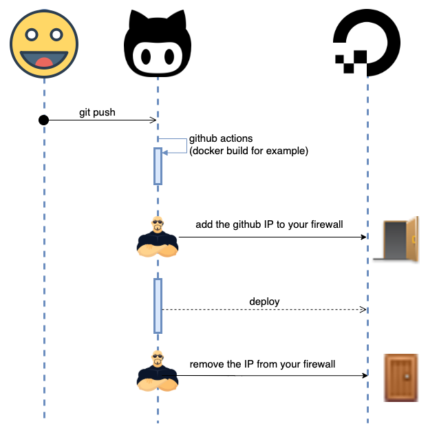
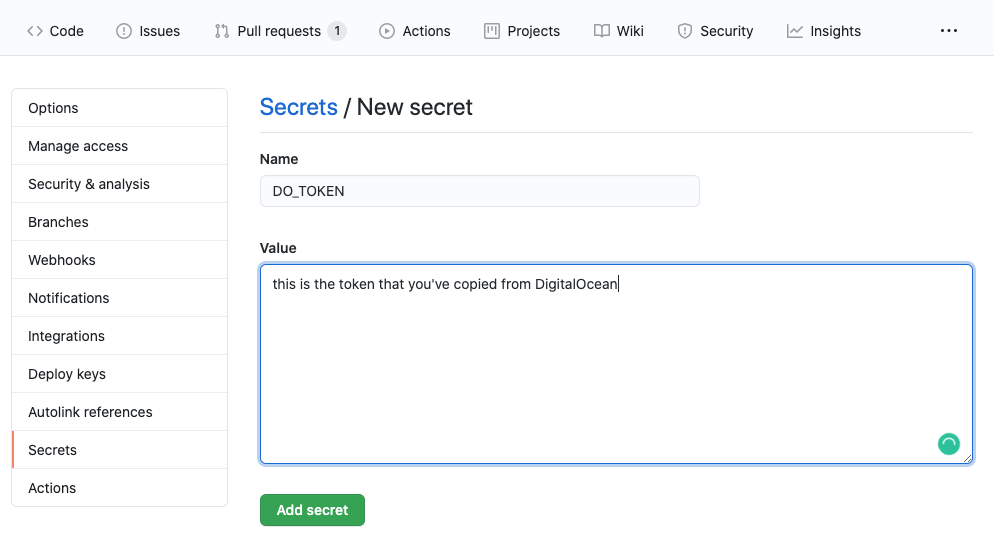

Doorman DigitalOcean Action
===========================

This Github action allows you to open or close an specific port in your DigitalOcean firewall.
It's really useful for deploy in your instances from Github Actions, as [they don't provide a list of IPs to add to your security groups](https://help.github.com/en/actions/reference/virtual-environments-for-github-hosted-runners#ip-addresses-of-github-hosted-runners).




Usage
-----
You need to generate a **personal access token** from [your DigitalOcean Applications & API](https://cloud.digitalocean.com/account/api/tokens) page.


Copy that token, and paste in the secrets of your repo:


Create or update a workflow, adding the file `.github/workflows/doorman.yml` ([more info about how to use Github Actions](https://help.github.com/en/actions/getting-started-with-github-actions/starting-with-preconfigured-workflow-templates)).


```yaml

############################
## prepare your artifacts ##
############################

  - name: Opening ports
    id: opening
    uses: ./
    with:
      digitaloceanToken: ${{ secrets.DO_TOKEN }}
      firewallName: "name_of_your_droplet"
      actionToDo: "add"
      dryRun: false

############################
## deploy to DigitalOcean ##
############################

  - name: Closing ports
    id: closing
    uses: ./
    with:
      digitaloceanToken: ${{ secrets.DO_TOKEN }}
      firewallName: "name_of_your_droplet"
      actionToDo: "remove"
      dryRun: false
```

To check that everything is working as expected, you have to push these changes to your repo, and a new build in the `Actions` tab should be starting.


Development
-----------
First of all, you have to install the dependencies:
```bash
npm install
```

I've been using [act](https://github.com/nektos/act) to test the action in local, and it's really useful because it doesn't require to push anything to github.
To use it, you only need to run the `pack` script, which will create the `dist/index.js`, and run the action with `act`:

```bash
npm run pack && act -j local -s DO_TOKEN
```

You can also run the code itself using:
```bash
ts-node src/main.ts
```

LICENSE
-------

```
MIT License

Copyright (c) 2020 Jorge Maroto García

Permission is hereby granted, free of charge, to any person obtaining a copy
of this software and associated documentation files (the "Software"), to deal
in the Software without restriction, including without limitation the rights
to use, copy, modify, merge, publish, distribute, sublicense, and/or sell
copies of the Software, and to permit persons to whom the Software is
furnished to do so, subject to the following conditions:

The above copyright notice and this permission notice shall be included in all
copies or substantial portions of the Software.

THE SOFTWARE IS PROVIDED "AS IS", WITHOUT WARRANTY OF ANY KIND, EXPRESS OR
IMPLIED, INCLUDING BUT NOT LIMITED TO THE WARRANTIES OF MERCHANTABILITY,
FITNESS FOR A PARTICULAR PURPOSE AND NONINFRINGEMENT. IN NO EVENT SHALL THE
AUTHORS OR COPYRIGHT HOLDERS BE LIABLE FOR ANY CLAIM, DAMAGES OR OTHER
LIABILITY, WHETHER IN AN ACTION OF CONTRACT, TORT OR OTHERWISE, ARISING FROM,
OUT OF OR IN CONNECTION WITH THE SOFTWARE OR THE USE OR OTHER DEALINGS IN THE
SOFTWARE.
```

- The Doorman Icon was [downloaded from Vecteezy](https://www.vecteezy.com/free-vector/doorman).
